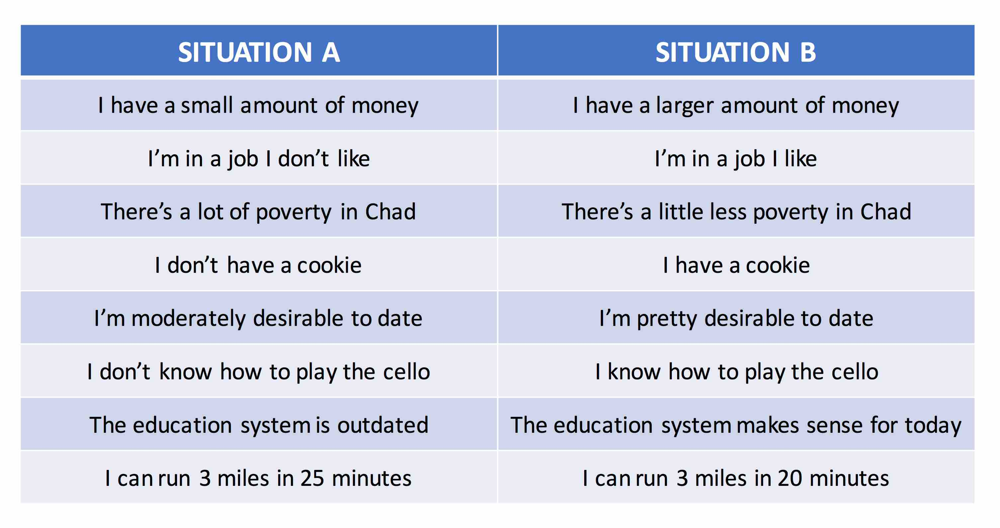
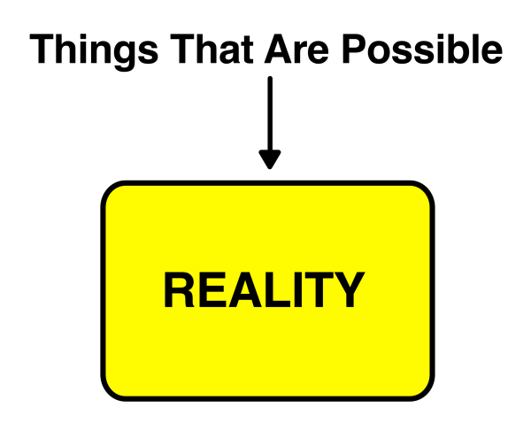
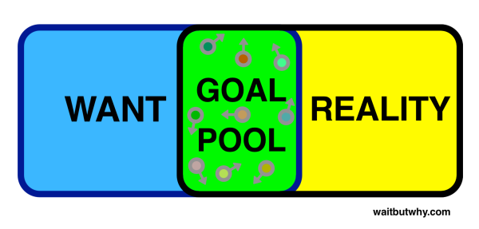
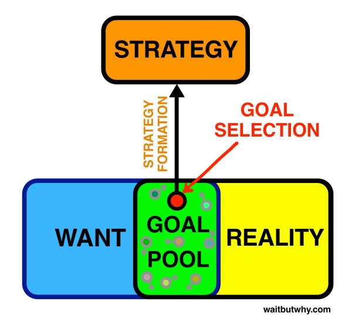
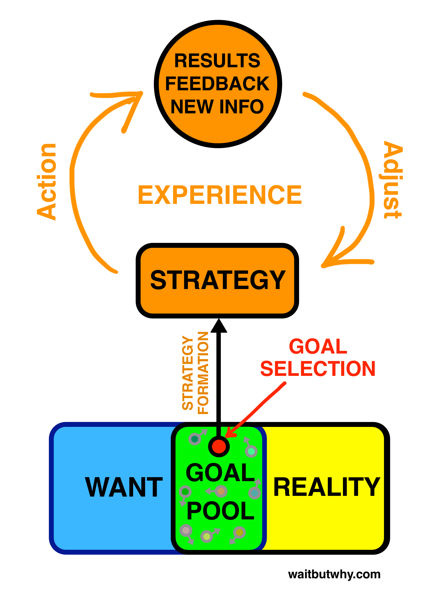
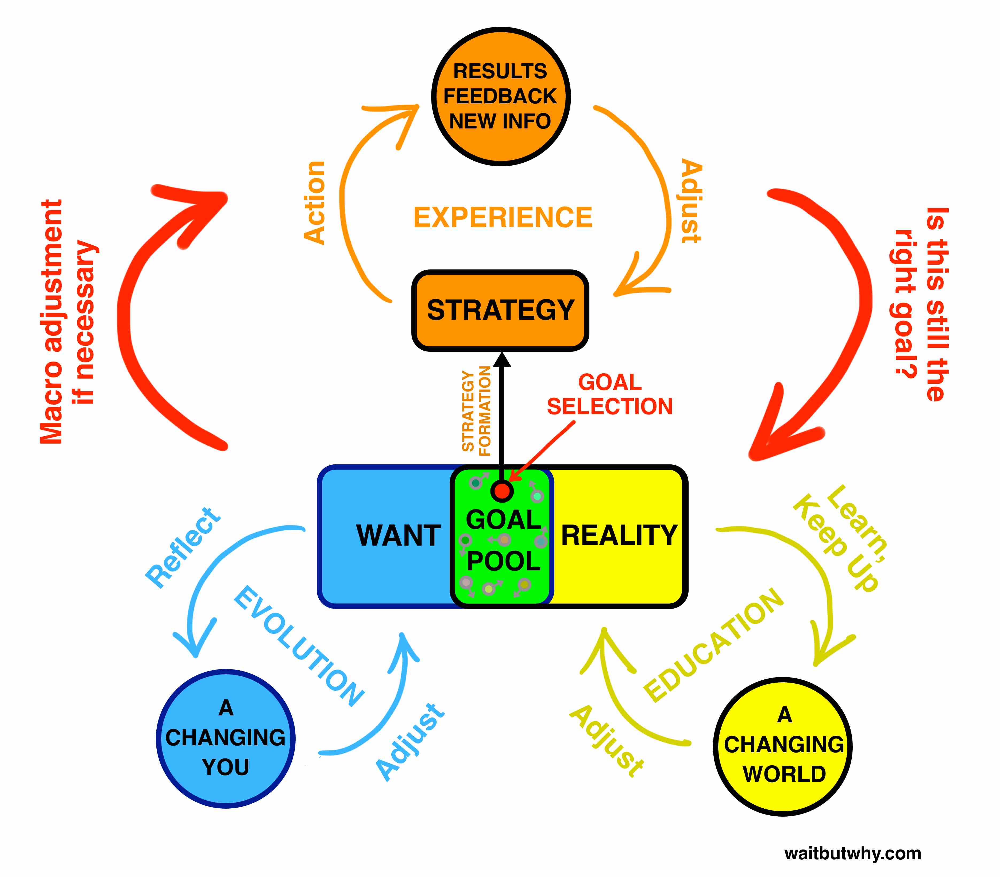
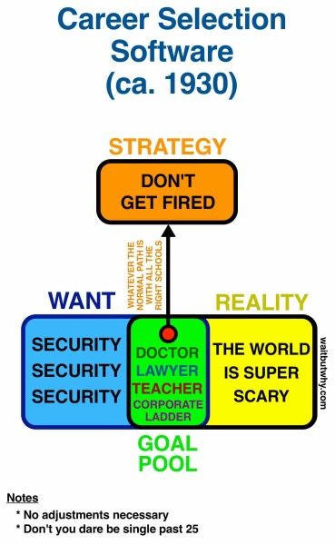

# The Cook and the Chef

## Elon's Musk characteristics - based on Alex Vance book

- Nanomanaging - know every detail about his rockets
- When learning - develops tree trunk understanding
- "If something requires inspiring words to be done, it is not worth doing"
- Generating ideas
  - What would be the best way to solve something?
  - Combine ideas from different industries
- He always proclaims the reasons for things
  - "I think we are about 8 to 10 years away from this being usable by people with no disability … It is important to note that this depends heavily on regulatory approval timing and how well our devices work on people with disabilities."
- He lives in the big picture, and his only lens is the maximum zoom-out. That’s why he’s such an unusual visionary. It’s also why he’s so worried.
- "Yes, but increasing bandwidth by orders of magnitude would make it better. And it’s directionally correct. **Does it solve all problems? No. But is it directionally correct? Yes. If you’re going to go in some direction, well, why would you go in any direction other than this?**"
- Hire only the best people fast and fire them fast if it doesn't work
- Know everything about everything in your company, know every detail

## [Musk's Secret Sauce](https://waitbutwhy.com/2015/11/the-cook-and-the-chef-musks-secret-sauce.html)

### APPLY LOGICAL REASONING TO EVERYTHING

- Flood geologists / scientist geologists
- Data and logic are far more effective tools than faith and scripture
- When it comes to most of the way we think, the way we make decisions, and the way we live our lives, we’re much more like the flood geologists than the science geologists.
- And Elon’s secret? He’s a scientist through and through.

### Hardware and Software

Human child vs Elon child:

- Human child: “I’m scared of the dark, because that’s when all the scary shit is gonna get me and I won’t be able to see it coming.”
- Elon child: “When I was a little kid, I was really scared of the dark. But then I came to understand, dark just means the absence of photons in the visible wavelength—400 to 700 nanometers. Then I thought, well it’s really silly to be afraid of a lack of photons. Then I wasn’t afraid of the dark anymore after that.”

Human single man vs Elon single man:

- Human single man: “I’d like to find a girlfriend. I don’t want to be so busy with work that I have no time for dating.”
- Elon: “I would like to allocate more time to dating, though. I need to find a girlfriend. That’s why I need to carve out just a little more time. I think maybe even another five to 10 — how much time does a woman want a week? Maybe 10 hours? That’s kind of the minimum? I don’t know.”

**MuskSpeak is a language that describes everyday parts of life as exactly what they actually, literally are.**

Having kids made him more comfortable with dying, because “kids sort of are a bit you. At least they’re half you. They’re half you at the hardware level, and depending on how much time you have with them, they’re that percentage of you at the software level.”

**People are computers. - Musk's thinking**

MuskSpeak can serve us well—because thinking of a brain as a computer forces us to consider the distinction between our hardware and our software, a distinction we often fail to recognize.

### Elon’s Software

#### 1. Software - Want Box

This box contains anything in life where you want Situation A to turn into Situation B. Situation A is currently what’s happening and you want something to change so that Situation B is what’s happening instead.

#### 2. Software - Reality Box

All things that are possible.

#### 3. Software - Goal Pool

The overlap of the Want and Reality boxes is the Goal Pool, where your goal options live.

So you pick a goal from the pool—the thing you’re going to try to move from Point A to Point B.

Examples:

- And how do you cause something to change? You direct your power towards it. A person’s power can come in various forms: your time, your energy (mental and physical), your resources, your persuasive ability, your connection to others, etc.
- The concept of employment is just Person A using their resources power (a paycheck) to direct Person B’s time and/or energy power toward Person A’s goal.
- When Oprah publicly recommends a book, that’s combining her abundant power of connection (she has a huge reach) and her abundant power of persuasion (people trust her) and directing them towards the goal of getting the book into the hands of thousands of people who would have otherwise never known about it.

#### 4. Software - Strategy Box

Once a goal has been selected, you know the direction in which to point your power. Now it’s time to figure out the most effective way to use that power to generate the outcome you want—that’s your strategy.

#### Why this works for Musk so well? #elonsframework

##### Elon builds each software component himself, from the ground up.

- **reasoning from first principles**
- Examples
  - "I think generally people’s thinking process is too bound by convention or analogy to prior experiences. It’s rare that people try to think of something on a first principles basis. They’ll say, “We’ll do that because it’s always been done that way.” Or they’ll not do it because “Well, nobody’s ever done that, so it must not be good.” But that’s just a ridiculous way to think. You have to build up the reasoning from the ground up—“from the first principles” is the phrase that’s used in physics. You look at the fundamentals and construct your reasoning from that, and then you see if you have a conclusion that works or doesn’t work, and it may or may not be different from what people have done in the past."
  - In science, this means starting with what evidence shows us to be true. A scientist doesn’t say, “Well we know the Earth is flat because that’s the way it looks, that’s what’s intuitive, and that’s what everyone agrees is true,” a scientist says, “The part of the Earth that I can see at any given time appears to be flat, which would be the case when looking at a small piece of many differently shaped objects up close, so I don’t have enough information to know what the shape of the Earth is. One reasonable hypothesis is that the Earth is flat, but until we have tools and techniques that can be used to prove or disprove that hypothesis, it is an open question.”

##### Musk works through each of these boxes by reasoning from first principles.

1. Filling in the Want box
  - Filling in the Want box from first principles requires a deep, honest, and independent understanding of yourself.
2. Filling in the Reality box
  - Filling in the Reality box requires the clearest possible picture of the actual facts of both the world and your own abilities.
3. Goal selection from the Goal Pool
  - The Goal Pool should double as a Goal Selection Laboratory that contains tools for intelligently measuring and weighing options.
4. Strategy formation
  - And strategies should be formed based on what you know, not on what is typically done. (me: those could be the same things, but you need to verify that)

##### Elon continually adjusts each component’s conclusions as new information comes in.

In math:
- Given: A = B
- Given: B = C + D
- Therefore: A = C + D

In science:
- Given (it seems, based on what I know): A = B
- Given (it seems, based on what I know): B = C + D
- Therefore (it seems, based on what I know): A = C + D

**Hypotheses are built to be tested**. Testing a hypothesis can disprove it or strengthen it, and if it passes enough tests, it can be upgraded to a theory.

**So after Musk builds his conclusions from first principles, what does he do? He tests the shit out of them, continually, and adjusts them regularly based on what he learns.**

Let’s go through the whole process to show how:

You begin by reasoning from first principles to A) fill in the Want box, B) fill in the Reality box, C) select a goal from the pool, and D) build a strategy—and then you get to work. You’ve used first principles thinking to decide where to point your power and the most effective way to use it.

But the goal-achievement strategy you came up with was just your first crack. It was a hypothesis, ripe for testing. You test a strategy hypothesis one way: action. You pour your power into the strategy and see what happens. As you do this, data starts flowing in—results, feedback, and new information from the outside world. Certain parts of your strategy hypothesis might be strengthened by this new data, others might be weakened, and new ideas may have sprung to life in your head through the experience—but either way.

**=> Software - Strategy Loop:**

**Want box is a hypothesis**

**Reality box is a hypothesis**

Filling in your Reality box from first principles is a great challenge, and keeping the box current so that it matches actual reality takes continual work.

Full software:

## How Musk’s software wrote his life story

### Step 1

Step 1 for Elon was filling in the contents of the Want box.

Doing this from first principles is a huge challenge—you have to dig deep into concepts like right and wrong, good and bad, important and trivial, valuable and frivolous. You have to figure out what you respect, what you disdain, what fascinates you, what bores you, and what excites you deep in your inner child. Of course, there’s no way for anyone of any age to have a clear cut answer to these questions, but Elon did the best thing he could by ignoring others and independently pondering.

I talked with him about his early thought process in figuring out what to do with his career. He has said many times that he cares deeply about the future well-being of the human species—something that is clearly in the center of his Want box.

> "I see the future as a series of branching probability streams."

**What will most affect the future of humanity?**

- the internet;
- sustainable energy;
- space exploration, in particular the permanent extension of life beyond Earth;
- artificial intelligence;
- reprogramming the human genetic code

### Step 2

Step 2 Meanwhile, he was a teenager with no money, reputation, or connections, and limited knowledge and skills. In other words, his Reality box wasn’t that big.

So he did what many young people do — **he focused his early goals not around achieving his Wants, but expanding the Reality box and its list of “things that are possible.”**

**"Formal education was just another way to download information into your brain and “a painfully slow download”"**

> “When something is important enough, you do it even if the odds are not in your favor.” ~Elon Musk

Musk sees people as computers, and he sees his brain software as the most important product he owns—and since there aren’t companies out there designing brain software, he designed his own, beta tests it every day, and makes constant updates.

## Most People’s Software

**Not only do most of us not obsess over our own software—most of us don’t even understand our own software, how it works, or why it works that way.**

A newborn’s brain is a malleable ball of hardware clay, and its job upon being born is to quickly learn about whatever environment it’s been born into and start shaping itself into the optimal tool for survival in those circumstances. That’s why it’s so easy for young children to learn new skills.

As people age, the clay begins to harden and it becomes more difficult to change the way the brain operates.
So when it comes to our brain software—our values, perceptions, belief systems, reasoning techniques—what are we learning during those key early years?

We were taught all kinds of things by our parents and teachers—what’s right and wrong, what’s safe and dangerous, the kind of person you should and shouldn’t be. But the idea was: I’m an adult so I know much more about this than you, it’s not up for debate, don’t argue, just obey. That’s when the cliché “Why?” game comes in (what MuskSpeak calls “the chained why”).

**A child’s instinct isn’t just to know what to do and not to do, she wants to understand the rules of her environment.**

**When parents and teachers tell a kid to do XYZ and to simply obey, it’s like installing a piece of already-designed software in the kid’s head.**

When kids ask Why? and then Why? and then Why?, they’re trying to deconstruct that software to see how it was built—to get down to the first principles underneath so they can weigh how much they should actually care about what the adults seem so insistent upon.

The first few times a kid plays the Why game, parents think it’s cute. But many parents, and most teachers, soon come up with a way to cut the game off:

- Because I said so.
- “Because I said so” inserts a concrete floor into the child’s deconstruction effort below which no further Why’s may pass. It says, “You want first principles? There. There’s your floor. No more Why’s necessary. Now fucking put your boots on because I said so and let’s go.”
- A command or a lesson or a word of wisdom that comes without any insight into the steps of logic it was built upon is feeding a kid a fish instead of teaching them to reason. And when that’s the way we’re brought up, we end up with a bucket of fish and no rod—a piece of installed software that we’ve learned how to use, but no ability to code anything ourselves.

### School makes things worse.

One of my favorite thinkers, writer Seth Godin (whose blog is bursting with first principles reasoning wisdom), explains in a TED Talk about school that the current education system is a product of the Industrial Age, a time that catapulted productivity and the standard of living. But along with many more factories came the need for many more factory workers, so our education system was redesigned around that goal. He explains:

> The deal was: universal public education whose sole intent was not to train the scholars of tomorrow — we had plenty of scholars. It was to train people to be willing to work in the factory. It was to train people to behave, to comply, to fit in. “We process you for a whole year. If you are defective, we hold you back and process you again. We sit you in straight rows, just like they organize things in the factory. We build a system all about interchangeable people because factories are based on interchangeable parts.”

Couple that concept with what another favorite writer of mine, James Clear, explained recently on his blog:

> In the 1960s, a creative performance researcher named George Land conducted a study of 1,600 five-year-olds and 98 percent of the children scored in the “highly creative” range. Dr. Land re-tested each subject during five year increments. When the same children were 10-years-old, only 30 percent scored in the highly creative range. This number dropped to 12 percent by age 15 and just 2 percent by age 25. As the children grew into adults they effectively had the creativity trained out of them. In the words of Dr. Land, “non-creative behavior is learned.”

**Creative thinking is a close cousin of first principles reasoning.**

People think of creativity as a natural born talent, but it’s actually much more of a way of thinking—it’s the thinking version of painting onto a blank canvas. But to do that requires brain software that’s skilled and practiced at coming up with new things, and school trains us on the exact opposite concept—to follow the leader, single-file, and to get really good at taking tests.

### Parents makes things worse

Just say you have an overbearing mother who insists you grow up with her values, her worldview, her fears, and her ambitions—because she knows best, because it’s a scary world out there, because XYZ is respectable, because she said so.

Your head might end up running your whole life on “because mom says so” software. If you play the Why? game with something like the reason you’re in your current job, it may take a few Why’s to get there, but you’ll most likely end up hitting a concrete floor that says some version of “because mom says so.”

***But why does mom say so?***

***Mom says so because her mom said so—after growing up in Poland in 1932, where she was from a home where her dad said so because his dad — a minister from a small town outside Krakow — said so after his grandfather, who saw some terrible shit go down during the Siberian Uprising of 1866, ingrained in his children’s heads the critical life lesson to never associate with blacksmiths.***

Career Selection Software ca 1930:

**When old software is installed on new computers, people end up with a set of values not necessarily based on their own deep thinking, a set of beliefs about the world not necessarily based on the reality of the world they live in, and a bunch of opinions they might have a hard time defending with an honest heart.**

## Dogma

Dogma is everywhere and comes in a thousand different varieties—but the format is generally the same:

**X is true because [authority] says so. The authority can be many things.**

**You may not like living by someone else’s dogma, but you’re left without much choice. When your childhood attempts at understanding are met with “Because I said so,” and you absorb the implicit message “Your own reasoning capability is shit, don’t even try, just follow these rules so you don’t fuck your life up,” you grow up with little confidence in your own reasoning process. When you’re never forced to build your own reasoning pathways, you’re able to skip the hard process of digging deep to discover your own values and the sometimes painful experience of testing those values in the real world and learning you want to adjust them—and so you grow up a total reasoning amateur.**

People don’t do any of this intentionally—usually if we reject a type of dogma, our intention is to break free of a life of dogmatic thinking altogether and brave the cold winds of independent reasoning.

But dogmatic thinking is a hard habit to break, especially when it’s all you know.

I have a friend who just had a baby, and she told me that she was so much more open-minded than her parents, because they wanted her to have a prestigious career, but she’d be open to her daughter doing anything. After a minute, she thought about it, and said, “Well actually, no, what I mean by that is if she wanted to go do something like spend her life on a farm in Montana, I’d be fine with that and my parents never would have been—but if she said she wanted to go work at a hedge fund, I’d kill her.” She realized mid-sentence that she wasn’t free of the rigid dogmatic thinking of her parents, she had just changed dogma brands.

## Tribes

Tribalism tends to have a negative connotation, but the concept of a tribe itself isn’t bad.

A tribe is just a group of people linked together by something they have in common—a religion, an ethnicity, a nationality, family, a philosophy, a cause. Christianity is a tribe. The US Democratic Party is a tribe. Australians are a tribe. Radiohead fans are a tribe. Arsenal fans are a tribe.

### Tribalism is good when the tribe and the tribe member both have an independent identity and they happen to be the same.

The tribe member has chosen to be a part of the tribe because it happens to match who he really is. If either the identity of the tribe or the member evolves to the point where the two no longer match, the person will leave the tribe. Let’s call this conscious tribalism.

### Tribalism is bad when the tribe and tribe member’s identity are one and the same.

The tribe member’s identity is determined by whatever the tribe’s dogma happens to say. If the identity of the tribe changes, the identity of the tribe member changes with it in lockstep. The tribe member’s identity can’t change independent of the tribal identity because the member has no independent identity. Let’s call this blind tribalism.

### With conscious tribalism, the tribe member and his identity comes first.

The tribe member’s identity is the alpha dog, and who he is determines the tribes he’s in. With blind tribalism, the tribe comes first. The tribe is the alpha dog and it’s the tribe that determines who he is.

This isn’t black and white—it’s a spectrum—but when someone is raised without strong reasoning skills, they may also lack a strong independent identity and end up vulnerable to the blind tribalism side of things—especially with the various tribes they were born into. That’s what Einstein was getting at when he said,

>“Few people are capable of expressing with equanimity opinions which differ from the prejudices of their social environment. Most people are even incapable of forming such opinions.”

### The allure of dogmatic tribes makes sense—they appeal to very core parts of human nature.

**Humans crave connection and camaraderie**, and a guiding dogma is a common glue to bond together a group of unique individuals as one.

**Humans want internal security**, and for someone who grows up feeling shaky about their own distinctive character, a tribe and its guiding dogma is a critical lifeline—a one-stop shop for a full suite of human opinions and values.

**Humans also long for the comfort and safety of certainty**, and nowhere is conviction more present than in the groupthink of blind tribalism. While a scientist’s data-based opinions are only as strong as the evidence she has and inherently subject to change, tribal dogmatism is an exercise in faith, and with no data to be beholden to, blind tribe members believe what they believe with certainty.

But there’s a heavy cost to these comforts. Insecurity can be solved the hard way or the easy way—and by giving people the easy option, **dogmatic tribes remove the pressure to do the hard work of evolving into a more independent person with a more internally-defined identity**. In that way, dogmatic tribes are an enabler of the blind tribe member’s deficiencies.

That key word (Us) in “People like us do stuff like this” can get you into trouble pretty quickly.

In blind tribalism, the tribe’s guiding dogma doubles as the identity of the tribe members, and the Us factor enforces that concept. Conscious tribe members reach conclusions—blind tribe members are conclusions.

The best friend of a blind Us is a nemesis Us—Them. Nothing unites Us like a collectively hated anti-Us, and the blind tribe is usually defined almost as much by hating the dogma of Them as it is by abiding by the dogma of Us.

## The Cook and the Chef

**The difference between the way Elon thinks and the way most people think is kind of like the difference between a cook and a chef.**

The chef reasons from first principles, and for the chef, the first principles are raw edible ingredients. Those are her puzzle pieces, her building blocks, and she works her way upwards from there, using her experience, her instincts, and her taste buds.

The cook works off of some version of what’s already out there—a recipe of some kind, a meal she tried and liked, a dish she watched someone else make.

**But what all cooks have in common is their starting point is something that already exists. Even the innovative cook is still making an iteration of a burger, a pizza, and a cake.**

### Chef-Cook Spectrum

In the culinary world, there’s nothing wrong with being a cook. Most people are cooks because for most people, inventing recipes isn’t a goal of theirs.

But in life—when it comes to the reasoning “recipes” we use to churn out a decision—we may want to think twice about where we are on the cook-chef spectrum.

On a typical day, a “reasoning cook” and a “reasoning chef” don’t operate that differently. Even the chef becomes quickly exhausted by the mental energy required for first principles reasoning, and usually, doing so isn’t worth his time. Both types of people spend an average day with their brain software running on auto-pilot and their conscious decision-making centers dormant.

**But then comes a day when something new needs to be figured out.**

The chef says, “Ugh okay, here we go,” rolls up his sleeves, and does what he always does in these situations—he switches on the active decision-making part of his software and starts to go to work.

He looks at what data he has and seeks out what more he needs. He thinks about the current state of the world and reflects on where his values and priorities lie. He gathers together those relevant first principles ingredients and starts puzzling together a reasoning pathway.

It takes some hard work, but eventually, the pathway brings him to a hypothesis.

He knows it’s probably wrong-ish, and as new data emerges, he’ll “taste-test” the hypothesis and adjust it.

He keeps the decision-making center on standby for the next few weeks as he makes a bunch of early adjustments to the flawed hypothesis—a little more salt, a little less sugar, one prime ingredient that needs to be swapped out for another.

Eventually, he’s satisfied enough with how things are going to move back into auto-pilot mode.

This new decision is now part of the automated routine—a new recipe is in the cookbook—and he’ll check in on it to make adjustments every once in a while or as new pertinent data comes in, the way he does for all parts of his software.

---

If you start looking for it, you’ll see the chef/cook thing happening everywhere.

There are chefs and cooks in the worlds of music, art, technology, architecture, writing, business, comedy, marketing, app development, football coaching, teaching, and military strategy.

And in each case, though both parties are usually just on autopilot, mindlessly playing the latest album again and again at concerts, it’s in those key moments when it’s time to write a new album—those moments of truth in front of a clean canvas, a blank Word doc, an empty playbook, a new sheet of blueprint paper, a fresh whiteboard—that the chef and the cook reveal their true colors.

**The chef creates while the cook, in some form or another, copies.**

**Being a chef isn’t being like Elon Musk—it’s being yourself.**

A follower, we think, is a weakling with no mind of their own. We think about leadership positions we’ve held and initiatives we’ve taken at work and the way we never let friends boss us around, and we take these as evidence that we’re no follower. Which in turn means that we’re not just a cook.

But the problem is—the only thing all of that proves is that you’re no follower within your tribe.

> In order to form an immaculate member of a flock of sheep one must, above all, be a sheep. ~Einstein

In other words, you might be a star and a leader in your world or in the eyes of your part of society, but if the core reason you picked that goal in the first place was because your tribe’s cookbook says that it’s an impressive thing and it makes the other tribe members gawk, you’re not being a leader—you’re being a super-successful follower.

### Most people aren't chefs at all

**Musk is an impressive chef for sure, but what makes him such an extreme standout isn’t that he’s impressive—it’s that most of us aren’t chefs at all.**

**It’s like a bunch of typewriters looking at a computer and saying, “Man, that is one talented typewriter.”**

“People consider X to be scary, but their fear is not based on logic, so I’m not scared of X.” That’s not courage—that’s logic.

Courage means doing something risky. Risk means exposing yourself to danger. We intuitively understand this—that’s why most of us wouldn’t call child Elon courageous for sleeping with the lights off. Courage would be a weird word to use there because no actual danger was involved.

1) We mistake the chef’s clear view of the present for vision into the future.
2) We mistake the chef’s accurate understanding of risk for courage.
3) We mistake the chef’s originality for brilliant ingenuity.

**Yeah, Musk is smart as fuck and insanely ambitious—but that’s not why he’s beating everybody.**

**What makes Musk so rad is that he’s a software outlier. A chef in a world of cooks. A science geologist in a world of flood geologists. A brain software pro in a world where people don’t realize brain software is a thing.**

The curious thing about the car industry isn’t why Tesla is focusing so hard on electric cars, and the curious thing about the aerospace industry isn’t why SpaceX is trying so hard to make rockets reusable—the fascinating question is why they’re the only companies doing so.

🚨 **We spent this whole time trying to figure out the mysterious workings of the mind of a madman genius only to realize that Musk’s secret sauce is that he’s the only one being normal.** 🚨
